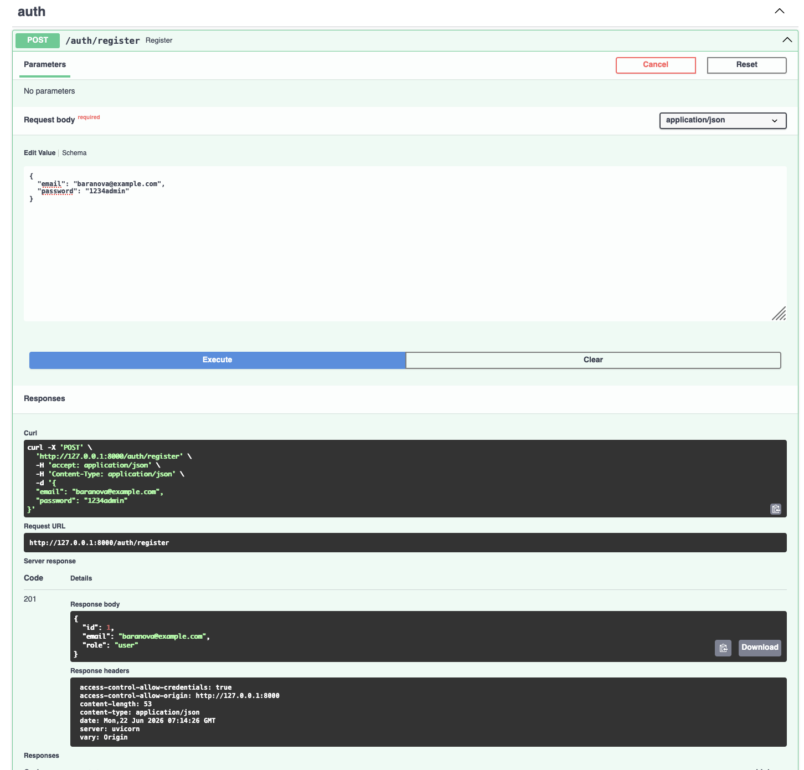
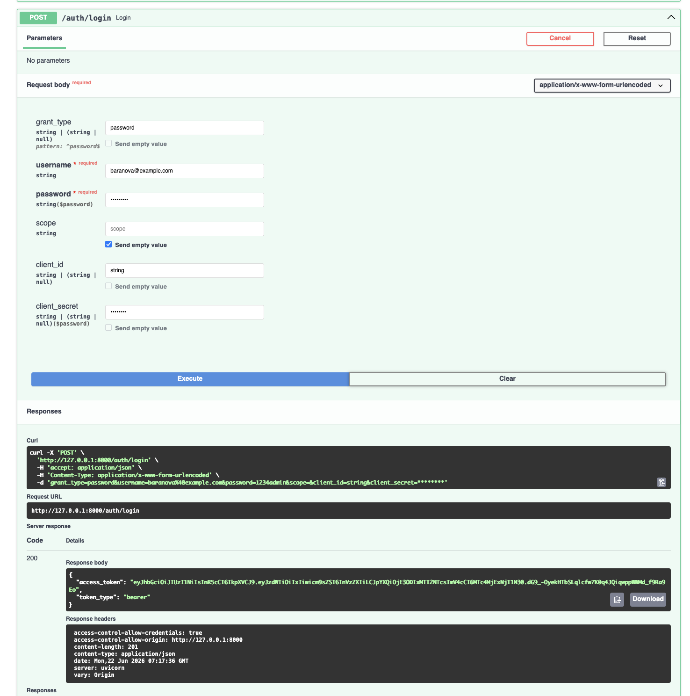
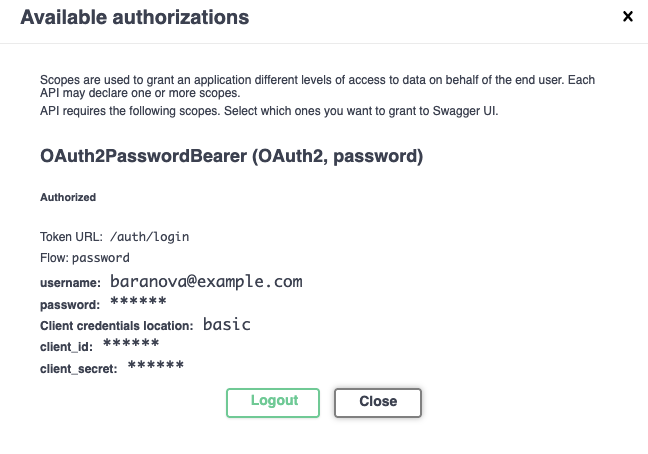
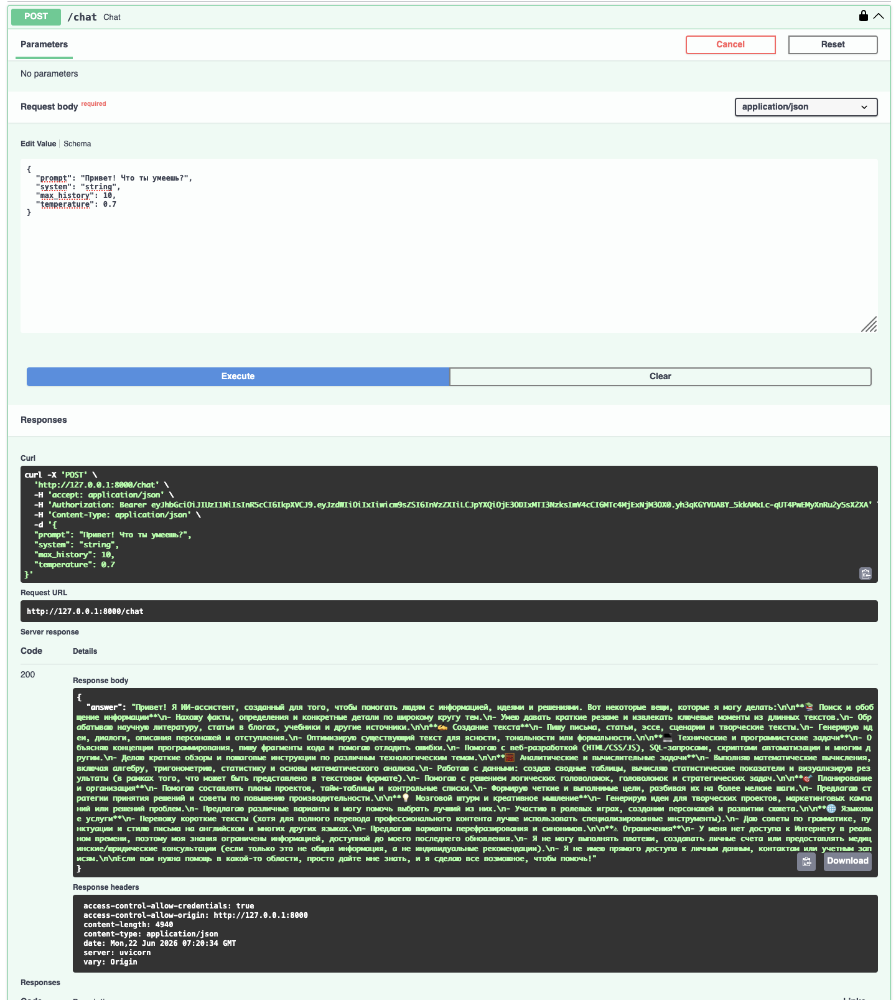
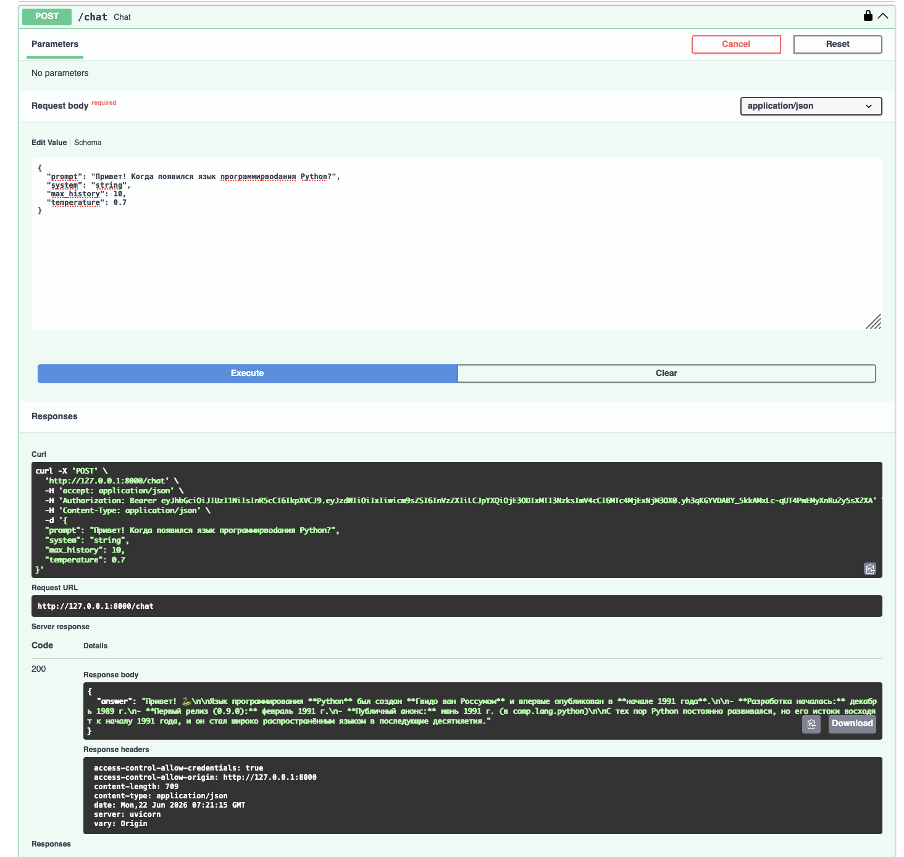
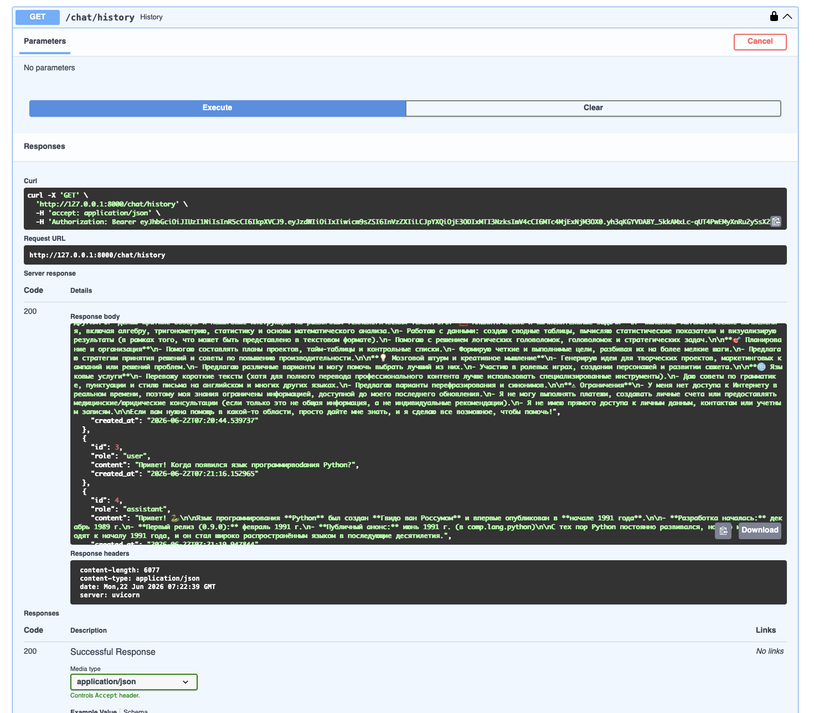
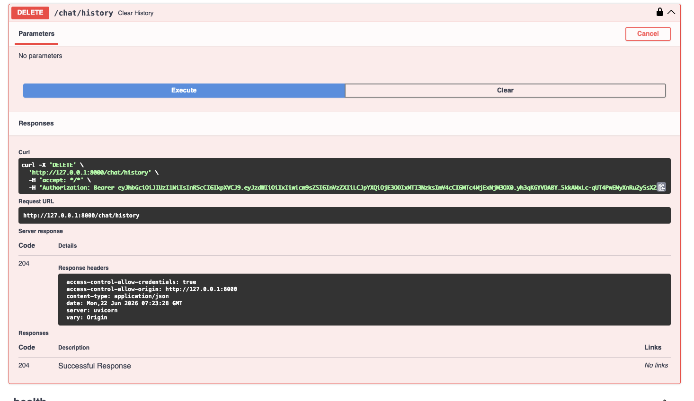
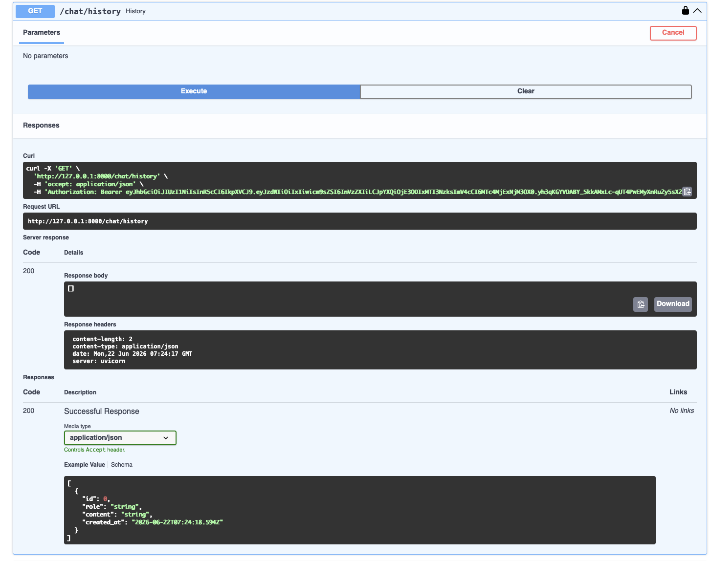

# llm_p

FastAPI-сервис с JWT-аутентификацией, SQLite и интеграцией OpenRouter LLM.

## Установка и запуск

### 1. Установить uv

```bash
pip install uv
```

### 2. Создать виртуальное окружение

```bash
uv venv
```

### 3. Активировать окружение

```bash
# macOS / Linux
source .venv/bin/activate

# Windows
.venv\Scripts\activate.bat
```

### 4. Установить зависимости

```bash
uv pip install -r <(uv pip compile pyproject.toml)
```

### 5. Настроить переменные окружения

Скопировать `.env.example` в `.env`:

```bash
cp .env.example .env
```

Открыть `.env` и вставить свой API-ключ от [openrouter.ai](https://openrouter.ai):

```
OPENROUTER_API_KEY=your_key_here
```

### 6. Запустить сервер

```bash
uvicorn app.main:app --reload --host 0.0.0.0 --port 8000
```

### 7. Открыть документацию

```
http://localhost:8000/docs
```

## Эндпоинты

| Метод | URL | Описание |
|-------|-----|----------|
| POST | `/auth/register` | Регистрация пользователя |
| POST | `/auth/login` | Логин, получение JWT |
| GET | `/auth/me` | Профиль текущего пользователя |
| POST | `/chat` | Отправить вопрос модели |
| GET | `/chat/history` | История диалога |
| DELETE | `/chat/history` | Очистить историю |
| GET | `/health` | Статус сервера |

## Демонстрация работы

### 1. Регистрация пользователя

Эндпоинт `POST /auth/register`. 



---

### 2. Логин и получение JWT-токена

Эндпоинт `POST /auth/login`. В ответе возвращается `access_token`.



---

### 3. Авторизация в Swagger

 **Authorize** в правом верхнем углу



---

### 4. Запрос к LLM

Эндпоинт `POST /chat`. Запрос передаётся в OpenRouter, ответ сохраняется в истории.




---

### 5. История диалога

Эндпоинт `GET /chat/history`. Возвращает все сообщения текущего пользователя.



---

### 6. Очистка истории

Эндпоинт `DELETE /chat/history`. Удаляет всю историю текущего пользователя.


